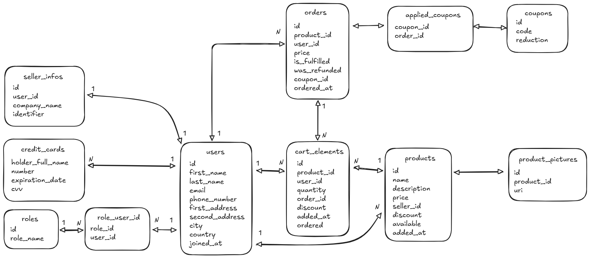

# Alex Shop
## The Server

The server is written in Java with the spring framework, and I used the following packages

- Spring security and Spring session for managing user session and authentication.
- Spring JPA for database connectivity and postgres for the database
- Spring web for serving the data
- Spring validation to validate the data 

I decided not to use Lombok because it caused me troubles with Jetbrain Idea. 

### The database
I used Postgres for the database, and I roughly followed the following diagram, I followed [this article](https://vladmihalcea.com/the-best-way-to-map-a-onetomany-association-with-jpa-and-hibernate/) to help me with the mapping.

