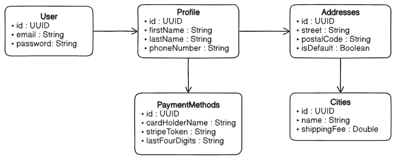

# UserService
This service is responsible for the management of user credentials, profile details and payment methods.

Each entity has its own corresponding _service, mapper, DTO, repository and controller_. With the **CRUD** implemented
for all the entities.